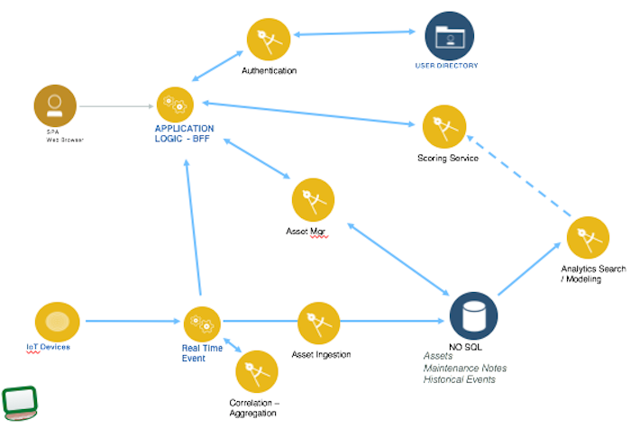
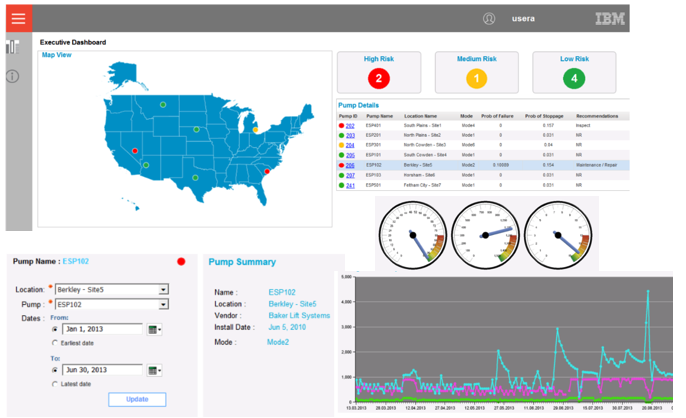
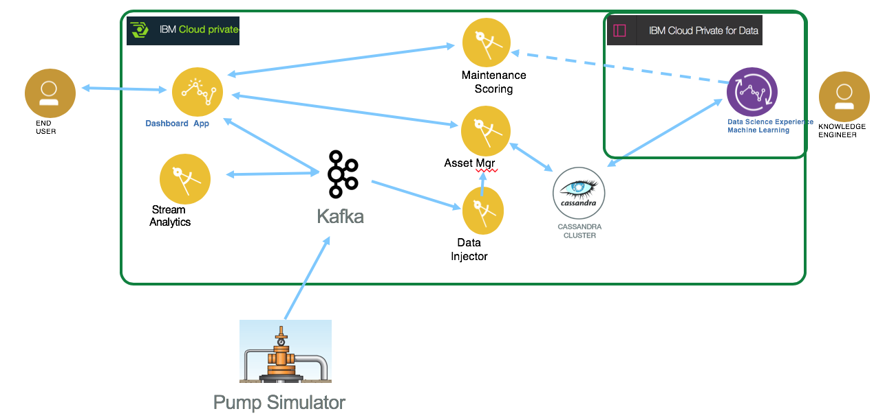

# Manufacturing Asset Predictive Maintenance

This project is part of the 'IBM Hybrid Analytics and Big Data Architecture' reference architecture implementation, available at https://github.com/ibm-cloud-architecture/refarch-analytics. This set of projects presents an end to end solution to enable predictive maintenance capabilities on manufacturing assets.
The problem space is related to continuous operation and service on manufacturing asset like [Electrical Submersible Pump](https://en.wikipedia.org/wiki/Submersible_pump), but any assets with sensors can be considered with the same of solution.

The use case is also adaptable and the architecture, solution components can be used for a security treat analysis on a park of devices or assets connected to a company intranet: real time events come from device that need to be aggregated and correlated and analytics run can be performed on historical data to assess security risk. Alert can be published to dashboard user interface.      

## Table of content
* [Use case](#use-case)
* [System Context](#system-context) to present the solution components
* [Deployment to kubernetes cluster like IBM Cloud Private](#deployment)
* Sub projects
  * [Event consumers](asset-consumer/README.md)
  * [Event producers simulator](asset-event-producer/README.md) to simulate pump events for demonstration purpose.
  * [Dashboard BFF](asset-dashboard-bff/README.md) to present a mix of static and real time data.
  * [Asset manager microservice](asset-mgr-ms/README.md) to export RESTful API to manage Asset CRUD operations
  * [Angular 6 user interface to present dashboard](asset-dashboard-ui/README.md)
* [Demonstration script](docs/demo.md)
* [Analytics model](docs/analytics/README.md)
* Future readings
  * [Kafka related](https://github.com/ibm-cloud-architecture/refarch-analytics/tree/master/docs/kafka)
  * [Cassandra](docs/cassandra/readme.md)
  * [Microservice mesh](https://github.com/ibm-cloud-architecture/refarch-integration/blob/master/docs/service-mesh.md)

## Use Case
### The challenge
The adoption of IoT, smart devices, in manufacturing industry brings opportunity to predict future maintenance on high cost equipment before failure. The cost control for maintenance operation combined with optimizing device utilization are continuous challenges engineers are facing.
### The solution
A set of geographically distributed electrical submersible pumps (can apply to any manufacturing IoT equipments) are sending stream of data about important physical measurements that needs to be processed in real time, and persisted in big data storage. By adding traditional analytics combined with unstructured data as field engineer's reports, it is possible to build a solution that delivers a risk of failure ratio, in real time, from measurements received.

The solution combines key performance indicators aggregation, real time reporting to a web based dashboard user interface component, risk scoring microservice, and big data sink used by data scientists to develop and tune analytics and machine learning models.  


Data are continuously persisted in a document oriented database, we selected [Cassandra](http://cassandra.apache.org/) as a data sink. The real time event processing is supported by [Kafka](http://cassandra.apache.org/) and Kafka streaming. The microservices are done in Java, one in microprofile and one in Java.

### The Benefits
The solution gives visibility to analysts and executive about the real time status of the devices in the grids, with an aggregate view of the ones at risk. The device operation was increased by 15% and the unpredictable failure rate decreased by 85%. The model added diagnostic capabilities to help field engineers to deliver better maintenance.

## System Context
The processing starts by the continuous event flow emitted by a set of monitored devices. The event platform offers pub-subs capabilities and flow processing to aggregate and correlate events so dash board monitoring can be implement on the stateful operators. Data sink are used to keep Asset information, physical measurements over time and maintenance reports. Risk scoring service is deployed as a REST operation, build from a model developed by analytics and machine learning capabilities. Assets are exposed via microservice.



1. The application logic is split between the backend for frontend component, and the different microservice or streaming operators. The BFF is a web app exposing a user interface and the business logic to serve end users. For example when a new device or pump is added to the grid, a record is pushed to the user interface. All the real time metrics per device are also visible on the user interface. The supporting project is [the Dashboard BFF](asset-dashboard-bff/README.md)
1. The user interface is Angular 6 and the dash board look like the following wireframe:
  
and the project is under the [asset-dashboard-ui](./asset-dashboard-ui) folder.
1. Manage CRUD operation on the assets. See [the Asset manager microservice code.](asset-mgr-ms/README.md)

The following diagram illustrates the IBM Cloud Private, kubernetes deployment we are doing in this solution. You will find the same components as in the system context above, with added elements for data management and data scientists using [ICP for Data](https://www.ibm.com/analytics/cloud-private-for-data).



## Deployment
### Pre-requisites
You need to have access to a kubernetes cluster like IBM Cloud Private. We are providing a script under ./scripts/validateConfig.sh to help you validate the prerequisites.

* If not done already create a namespace named `greencompute`
* Get the admin security token and then use it in the set-credentials command below:

```
kubectl config set-cluster green-cluster --server=https://169.47.77.137:8001 --insecure-skip-tls-verify=true
kubectl config set-context green-cluster-context --cluster=green-cluster
kubectl config set-credentials admin --token=eyJ0...Ptg
kubectl config set-context green-cluster-context --user=admin --namespace=greencompute
kubectl config use-context green-cluster-context
```

### Deploying Cassandra
There is no Cassandra helm chart currently delivered with ICP Helm catalog. We are using volume, service and statefuleset deployment files from the `deployments/cassandra` folder and the installation instructions are [here](./docs/cassandra/readme.md). We also describe the potential architecture decisions around deploying Cassandra for high availability.

When the pods are up and running use the [following commands](https://github.com/ibm-cloud-architecture/refarch-asset-analytics/blob/master/docs/cassandra/readme.md#define-assets-table-structure-with-cql) to create the keyspace and tables.

### Deploying Kafka
We are presenting different deployment models, all based on container: with docker, docker edge with local kubernetes for your development environment, IBM Cloud Private for dev or staging. See details [in this note](
  https://github.com/ibm-cloud-architecture/refarch-analytics/tree/master/docs/kafka#run-kafka-in-docker)

### Solution Deployment on ICP
Each component of the solution is compiled and packaged as container. Here is the list of supported deployment:
* [Asset management microservice deployment](asset-mgr-ms/README.md#deploy)
* [Asset consumer and injector to Cassandra](asset-consumer/README.md#deploy)

Finally the pump simulator is a standalone java application used to produce different type of event. It does not need to be deployed to kubernetes.
