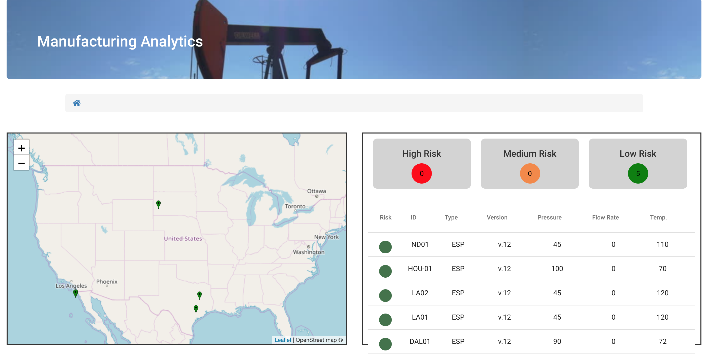
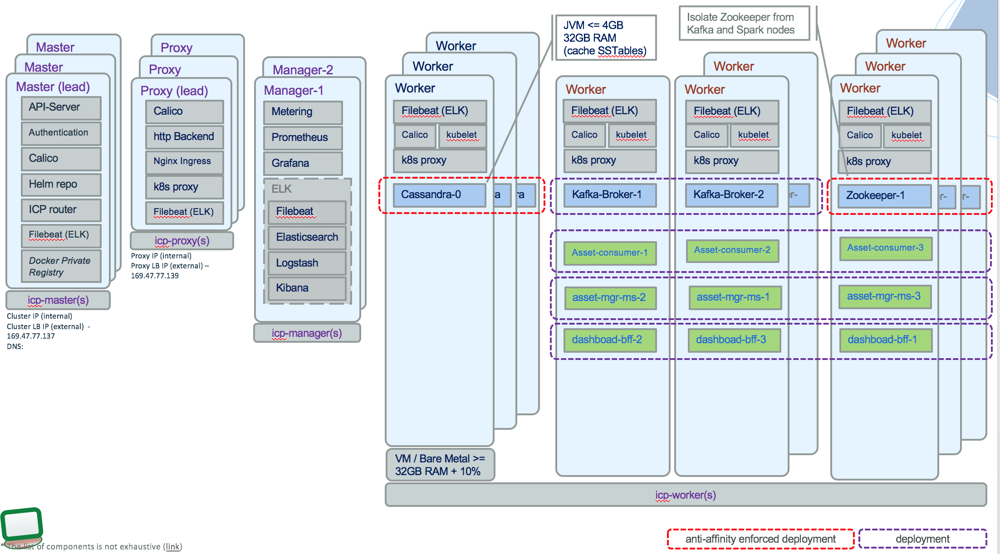

# Manufacturing Asset Predictive Maintenance

This project is part of the 'IBM Hybrid Analytics and Big Data Architecture' reference architecture implementation, available at https://github.com/ibm-cloud-architecture/refarch-analytics. This set of projects presents an end to end solution to enable predictive maintenance capabilities on manufacturing assets.
The problem space is related to continuous operation and service on manufacturing asset like [Electrical Submersible Pump](https://en.wikipedia.org/wiki/Submersible_pump), but any assets with sensors can be considered with the same of solution.

The use case is also adaptable and the architecture, solution components can be used for a security threat analysis on a park of devices or assets connected to a company intranet: real time events come from device that need to be aggregated and correlated and analytics run can be performed on historical data to assess security risk. Alert can be published to dashboard user interface.  

We are presenting best practices around data management, real-time streaming, cassandra high availability, microservices and serverless implementation.

## Table of contents

<details><summary><h2> </h2></summary>
<ul>
<li><a href="#use-case">Use case</a></li>
<li><a href="#system-context">System Context</a> to present the solution components</li>
<li><a href="#deployment">Deployment to kubernetes cluster like IBM Cloud Private</a></li>
<li>Related sub projects - repositories </li>
<ul>
<li><a href="asset-consumer/README.md">Event consumers</a></li>
<li><a href="asset-event-producer/README.md">Event producers simulator</a> to simulate pump events for demonstration purpose.</li>
<li><a href="asset-dashboard-ui/README.md">Angular 6 user interface to present dashboard</a> to present a mix of static and real time data.</li>
<li><a href="asset-dashboard-bff/README.md">Dashboard BFF</a> to present a mix of static and real time data.</li>
<li><a href="https://github.com/ibm-cloud-architecture/refarch-asset-manager-microservice">Asset management microservice</a> used to expose REST api in front of Cassandra persistence</li>
</ul>
<li><a href="docs/demo.md">Demonstration script</a></li>
<li><a href="docs/analytics/README.md">Analytics model</a></li>
<li>Future readings</li>
<ul>
<li><a href="https://github.com/ibm-cloud-architecture/refarch-analytics/tree/master/docs/kafka">Kafka related</a></li>
<li><a href="docs/cassandra/readme.md">Cassandra</a></li>
<li><a href="https://github.com/ibm-cloud-architecture/refarch-integration/tree/master/docs/service-mesh">Microservice mesh</a></li>
</ul>
</ul>
</details>

## Use Case

### The challenge

The adoption of IoT, smart devices, in manufacturing industry brings opportunity to predict future maintenance on high-cost equipment before failure. The cost control for maintenance operation combined with optimizing device utilization are continuous challenges engineers are facing.  For IT architects, the challenge is to address how to prepare to support adopting artificial intelligence capacity to support new business opportunities? How to support real-time data analytics at scale combined with big data and microservice architecture?

### The solution

A set of geographically distributed electrical submersible pumps (can apply to any manufacturing IoT equipment) are sending a data stream about important physical measurements that need to be processed in real-time and persisted in big data storage. By adding traditional analytics combined with unstructured data as field engineer's reports, it is possible to build a solution that delivers a risk of failure ratio, in real time, from measurements received.

The solution combines key performance indicators aggregation, real-time reporting to a web-based dashboard user interface component, risk scoring microservice, and big data sink used by data scientists to develop and tune analytics and machine learning models.  

Data are continuously persisted in a document oriented database, we selected [Cassandra](http://cassandra.apache.org/) as a data sink. The real time event processing is supported by [Kafka](http://kafka.apache.org/) and Kafka streaming. The microservices are done in Java, one in microprofile and one in Java. The data science work is done using [ICP for Data](https://www.ibm.com/analytics/cloud-private-for-data) and data science experience.

### The Benefits

The solution gives visibility to analysts and executive about the real time status of the devices in the grids, with an aggregate view of the ones at risk. The device operation was increased by 15% and the unpredictable failure rate decreased by 85%. The model added diagnostic capabilities to help field engineers to deliver better maintenance.

## System Context

The processing starts by the continuous event flow emitted by a set of monitored devices. The event platform offers pub-subs capabilities and flow processing to aggregate and correlate events so dash board monitoring can be implement on the stateful operators. Data sink are used to keep Asset information, physical measurements over time and maintenance reports. Risk scoring service is deployed as a REST operation, build from a model developed by analytics and machine learning capabilities. Assets are exposed via microservice.


1. The application logic is split between the backend for frontend components, and the different microservices or streaming operators. The BFF is a web app exposing a user interface and the business logic to serve end users. For example when a new device or pump is added to the grid, a record is pushed to the user interface. All the real time metrics per device are also visible on the user interface. The supporting project is [the Dashboard BFF](asset-dashboard-bff/README.md) and ...

1. The user interface is done using Angular 6 and aim to present a dashboard of the pump allocation and real time metrics. The wireframe looks like:  
   

and the project is under the [asset-dashboard-ui](./asset-dashboard-ui) folder.

1. Manage CRUD operation on the assets. See [the Asset manager microservice code.](https://github.com/ibm-cloud-architecture/refarch-asset-manager-microservice)

1. **Pump Simulator** is a java program running on developer laptop or on a server but external to ICP. The approach is to address communication to brokers deployed on ICP. The code and guidance are in the [asset-event-producer project](https://github.com/ibm-cloud-architecture/refarch-asset-analytics/tree/master/asset-event-producer#pump-simulator).

The following diagram illustrates the IBM Cloud Private deployment, we are using in this solution. You will find the same components as in the system context above, with added elements for data management and data scientists using [ICP for Data](https://www.ibm.com/analytics/cloud-private-for-data).


The pump simulator is a standalone Java application you can run on your computer to simulate n pumps. See [the producer project.](asset-event-producer/README.md)

## Deployment
We propose two possible deployments: one for quick validation in a development laptop (tested on Mac) and one on IBM Cloud Private cluster (tested on 2.1.0.3 and 3.1).

### Pre-requisites

* Clone this project to get all the kubernetes deployment files and source code of the different components.

* Clone the Event Driven Architecture reference project: [EDA](https://github.com/ibm-cloud-architecture/refarch-eda) to get Zookeeper and Kafka deployment manifests. As an alternate solution you can use the IBM Event Streams Helm chart from the ICP Catalog.
 ```
 git clone https://github.com/ibm-cloud-architecture/refarch-eda.git
 ```
* Clone the [asset management microservice using the microprofile branch](https://github.com/ibm-cloud-architecture/refarch-asset-manager-microservice) implementation.
  ```
  git clone https://github.com/ibm-cloud-architecture/refarch-asset-manager-microservice.git
  git checkout microprofile
  ```
* Access to a kubernetes deployment for development, for example on Mac, we use [Docker Edge](https://docs.docker.com/docker-for-mac/install/#download-docker-for-mac) distribution. You can use [this article](https://rominirani.com/tutorial-getting-started-with-kubernetes-with-docker-on-mac-7f58467203fd) to install Docker Edge and enable kubernetes.

For test and 'production' deployments you need to have access to a kubernetes cluster like IBM Cloud Private.
* Login to your cluster
We are providing multiple scripts to support connection and configuration validation:
 * To connect to your cluster: `./scripts/connectToCluster.sh`
 * To validate your dependencies: `./scripts/validateConfig.sh`. It may create the 'greencompute' namespace if it does not exist.

### Installing the Event Backbone
For your local environment install Zookeeper and Kafka using our development manifests:
#### Install Zookeeper for development
[Read instructions in this article](https://github.com/ibm-cloud-architecture/refarch-eda/tree/master/deployments/zookeeper/README.md)
#### Install Kafka for development
[Read instructions in this article](https://github.com/ibm-cloud-architecture/refarch-eda/tree/master/deployments/kafka/README.md)

For production we recommend to install IBM Events Streams  
#### Install IBM Event Streams
[Read instructions in this article](https://github.com/ibm-cloud-architecture/refarch-eda/tree/master/deployments/eventstreams/README.md)

### Asset and Event Datasource

There is no Cassandra helm chart currently delivered with ICP Helm catalog. The asset manager microservice has a helm chart to install Cassandra on ICP, and an helm chart for the microservice itself. In fact there is an umbrella chart to deploy both in one install. The instructions can be read [here](https://github.com/ibm-cloud-architecture/refarch-asset-manager-microservice/blob/microprofile/docs/icp.md). But it basically do the following helm install under the folder of refarch-asset-manager-microservice

```
helm install --name assetmanager asset/assetmanager --namespace greencompute --tls
```

We are also summarizing Cassandra concepts and some  installation considerations in  [this article](./docs/cassandra/readme.md). In the readme, we also describe the potential architecture decisions around deploying Cassandra for high availability.

When the pods are up and running use the [following commands](https://github.com/ibm-cloud-architecture/refarch-asset-analytics/blob/master/docs/cassandra/readme.md#define-assets-table-structure-with-cql) to create the needed keyspace and tables for the solution to run.

### Deploy the solution

The following steps are manual. We need to deploy the asset manager microservice first, then the different event consumers.

#### Deploy the asset manager microservice

The docker image is pushed to docker hub, therefore the manifests under `refarch-asset-manager-microservice/manifests` is using this image.
See instructions [in the project repository](https://github.com/ibm-cloud-architecture/refarch-asset-manager-microservice/blob/microprofile/docs/icp.md#run-the-app) to deploy it using helm.

#### Deploy UI with BFF

To deploy the BFF: the scripts and manifests are under the asset-dashboard-bff folder of this project. We document the deployment and build process in [these instructions](https://github.com/ibm-cloud-architecture/refarch-asset-analytics/tree/master/asset-dashboard-bff#build)

#### Populate the Cassandra with some assets

The project https://github.com/ibm-cloud-architecture/refarch-asset-manager-microservice has one script to do a `curl post` with json file representing pumps. You can change the URL to match your asset manager microservice endpoint, and then deploy the pump once the asset manager is deployed.

```shell
$ cd scripts
$ ./addAsset.sh pumpDAL01.json
$ ./addAsset.sh pumpHOU1.json
$ ./addAsset.sh pumpLA1.json
$ ./addAsset.sh pumpLA2.json
$ ./addAsset.sh pumpLA3.json
$ ./addAsset.sh pumpND1.json
$ ./getAssets.sh
```

The dashboard reports the imported pumps:


#### Deploy Asset Injector
TBD
#### Start Pump Simulator to add one asset
TBD
#### Start Pump Simulator to generate metrics event on existing pumps

Finally the [pump simulator](asset-event-producer/readme.md) is a standalone java application used to produce different types of event. It does not need to be deployed to kubernetes.

### ICP Deployment
The diagram below presents the deployment of the runtime components as well as Zookeeper, Kafka and Cassandra clusters deployed inside k8s:



* For high availability we need three masters, three proxies, 3 managers and at least 6 workers.
* Cassandra is deployed with 3 replicas and uses NFS based persistence volume so leverage shareable filesystems.
* Kafka is deployed with 3 replicas with anti affinity to avoid to have two pods on same node and also on the same node as Zookeeper's ones.
* Zookeeper is deployed with 3 replicas with anti affinity to avoid to have two pods on same node and on the same node as Kafka.   
This constraint explains the 6 workers.
* The component of the solution are deployed with at least 3 replicas: Asset manager microservice, dashboard BFF, and asset consumer/cassandra-injector.

* Get the admin security token and then use it in the set-credentials command below:

```
kubectl config set-cluster green-cluster --server=https://169.47.77.137:8001 --insecure-skip-tls-verify=true
kubectl config set-context green-cluster-context --cluster=green-cluster
kubectl config set-credentials admin --token=eyJ0...Ptg
kubectl config set-context green-cluster-context --user=admin --namespace=greencompute
kubectl config use-context green-cluster-context
```
We have added a script to support those commands so, once you run the script, just getting the security token for the admin user should be enough. See script named `scripts/connectToCluster.sh`


### Troubleshooting
As we are deploying different solutions into kubernetes we group [Troubleshooting notes here](https://github.com/ibm-cloud-architecture/refarch-integration/blob/master/docs/icp/troubleshooting.md) and [a technology summary here](https://jbcodeforce.github.io/#/studies)

## Contributors

* Lead development [Jerome Boyer](https://www.linkedin.com/in/jeromeboyer/)
* [Amaresh Rajasekharan for the data science part](https://www.linkedin.com/in/amaresh-rajasekharan/)
* [Hemankita Perabathini for the asset management microservice and ICP](https://www.linkedin.com/in/hemankita-perabathini/)
* [Zach Silverstein](https://www.linkedin.com/in/zsilverstein/)


Please [contact me](mailto:boyerje@us.ibm.com) for any questions.
