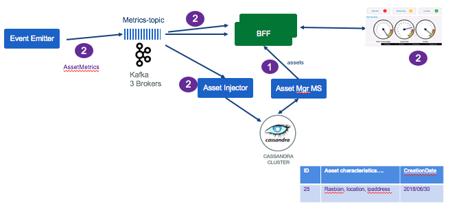

# Kafka Consumers
This project includes a set of standalone executable java classes, to consume records from a Kafka Topics and do some specific processing on the events.

* [Simple Event Print](#asset-event-print)
* [Asset metric injector using kafka and cassandra API](#asset_injector)

There is another consumer implemented as a Function in nodejs, see [the asset consumer funtcion project](../asset-consumer-function/README.md) which goal is to subscribe to new asset event: event occuring when a new pump is added somewhere.

We are proposing some best practices and considerations in [this article](https://github.com/ibm-cloud-architecture/refarch-eda/tree/master/docs/kafka/consumers.md)

## Asset Event print

The class in src/main/java ibm.cte.esp.AssetEventSimplestConsumer gets the AssetEvent from the asset-topic as a Kafka consumer record and parses the json object from the value string and prints it to stdout. This code loops forever and gets all the events publish in the topic. This simple code uses [org.apache.kafka.clients.consumer.KafkaConsumer API](https://kafka.apache.org/10/javadoc/?org/apache/kafka/clients/consumer/KafkaConsumer.html).
The code uses the config/config.properties to access remote Kafka brokers. You need to be sure to resolve the hostname (gc-kafka-0.gc-kafka-hl-svc.greencompute.svc.cluster.local) to the IP address of the kubernetes proxy, and the port (32224) is visible. This port number was used for exposing the kafka service. A better way is to use ingress config.

### Build and run

The maven pom defines an execution id so build and run are simple:

```
$ mvn compile
$ mvn exec:java@AssetPrint
```

## Asset Metric Injector

The `AssetInjector` class is executable as a standalone java class and its main goal is to listen to Asset Metric events and save them into Cassandra cluster. It is using Kafka api and Cassandra API.

The AssetInjector is packaged as container (See [Dockerfile in this project](./Dockerfile) and deployable to IBM Cloud private.

The following diagram illustrates how the 'Asset injector' consumes `asset metric events` from kafka and persists data into the cassandra `Assets` table.



First the BFF load asset (pump) information into the table of the Angular single page app. Then it subscribes to the metrics topic and consume metrics event to present in charts. In parallel the Asset Injector consume the same events but persist them to Cassandra. They will be used later to do data analysis and may be build a predictive model.

For the BFF layer to Web browser real time push pattern see [the asset dashboard BFF project](../asset-dashboard-bff)

### Code Explanation

The `ibm.cte.esp.AssetInjector.java` is a POJO which uses Kafka consumer API and Cassandra persistence API. It does three things:

1. Read configuration from external properties file
1. Create a cassandra DAO to persist assets to cassandra
1. Start a kafka consumer to get new asset event. Loop for ever.

To externalize parameters, we use the `conf/config.properties` file which will be mapped to a ConfigMap when deployed to kubernetes cluster.

For logging, as most of the APIs used ware using [slf4j](https://www.slf4j.org) and the default implementation of [logback](https://logback.qos.ch/), we added into `src/main/resource` a logback.xml configuration file to control the logging level as the DEBUG level is too low.


#### Using Kafka client API
The code is using the KafkaConsumer class and the ConsumerRecord to get the wrapper on the event. Our code implementation is exposing a `consume()`` method that is polling message every n ms.

The approach is simple:
* load properties
* create a consumer using the properties
```
kafkaConsumer = new KafkaConsumer<>(properties);
kafkaConsumer.subscribe(Arrays.asList(KAFKA_ASSET_TOPIC_NAME));
```
* expose a consume method to be used by the injector. This method poll data every n ms
```
ConsumerRecords<String, String> records = kafkaConsumer.poll(KAFKA_POLL_DURATION);
```
* the main class loop fore ever, and use the consume() method and process (save to cassandra) the n events received
```
public void run() {
  logger.info("########### Asset Injector START ##########");
      boolean runAgain = true;
      while (runAgain) {
         List<Asset> buffer = kafkaConsumer.consume();
        // commit offset only when persisted in DB.
        if (buffer.size() >= minBatchSize) {
          try {
            insertIntoDb(buffer);
            kafkaConsumer.commitOffset();
            buffer.clear();
          } catch (Exception e) {
            e.printStackTrace();
            runAgain = false;
          }
        }
      }
      kafkaConsumer.close();
}
```

#### Build and deployment
The code is packaged as docker container using the open jdk with Alpine linux image. The `scripts/build.sh` script uses maven and docker build. The `deployments/assetconsumer.yml` defines the Kubernetes deployment, configMap, and service.

The major trick is to externalize the config.properties to define kafka and cassandra parameters into a ConfigMap.

To deploy to your connected kubernetes cluster use the following steps:
```
#1: Tag the docker image with the name of the remote docker repository, the target namespace and the name and version of the image. For example for a remote repository running in IBM Cloud Private, use something like:
greencluster.icp:8500/ibmcase/asset-consumer:v0.0.1

#2: log to docker remote repo:
$ docker login greencluster.icp:8500

#3: docker push the newly created image to the remote repository:
$ docker push greencluster.icp:8500/ibmcase/casset-consumer:v0.0.1

#4: Change the image versioning in the yaml file and apply the changes
$ kubectl apply -f deployments/assetconsumer.yml
```


## Accessing remote cassandra deployed in kubernetes

When running on you development machine you can use a remote cassandra to test your application. Use the port-forwarding command to map local port to remote cassandra deployed pod.

```
# first get cassandra pod name
$ kubectl get pods --namespace greencompute | grep cassandra

# then get exposed node port
$ kubectl describe pod cassandra-0 --namespace greencompute

# then do local port forwarding to cassandra
$  kubectl port-forward cassandra-0 9042:9042 --namespace greencompute
```

 See also the Cassandra [article for preparing the environment](../docs/cassandra/readme.md) for the asset analytic.
