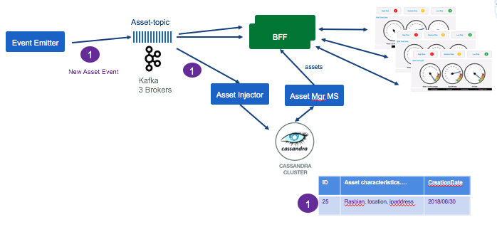

# Kafka Consumers
This project includes a set of standalone executable java classes, to consume records from a Kafka Topics and do some specific processing, one of them being to persist to Cassandra.
The `AssetInjector` class is executable as a standalone tool and its main goal is to listen to Asset events and save them into Cassandra cluster. It is using Kafka api and Cassandra API.

Another class is used to compute asset analytics as part of a Kafka streaming operator. It listens to a new measurement events coming from known assets and aggregate some metrics.

The AssetInjector is packaged as container (See [Dockerfile in this project](./Dockerfile) and deployed to IBM Cloud private.

### Features:
* Consume Asset event (new asset events, and measurement events) from Kafka topic
* Persist assets data to Cassandra cluster

The following diagram illustrates how the 'Asset injector' consumes `new asset event` from kafka and persists data into the cassandra `Assets` table.



For the BFF layer to Web browser real time push pattern see [the asset dashboard BFF project]

(../asset-dashboard-bff)

## Code Explanation
The `ibm.cte.esp.AssetInjector.java` is a POJO which uses Kafka consumer API and Cassandra persistence API. It does three things:
1. read configuration from external properties file
1. create a cassandra DAO to persist assets to cassandra
1. start a kafka consumer to get new asset event. Loop for ever.

To externalize parameters, we use the `conf/config.properties` file which will be mapped to a ConfigMap when deployed to kubernetes cluster.

For logging, as most of the APIs used ware using [slf4j](https://www.slf4j.org) and the default implementation of [logback](https://logback.qos.ch/), we added into `src/main/resource` a logback.xml configuration file to control the logging level as the DEBUG level is too low.


### Using Kafka client API
The code is using the KafkaConsumer class and the ConsumerRecord to get the wrapper on the event. Our code implementation is exposing a `consume()`` method that is polling message every n ms.

The approach is simple:
* load properties
* create a consumer using the properties
```
kafkaConsumer = new KafkaConsumer<>(properties);
kafkaConsumer.subscribe(Arrays.asList(KAFKA_ASSET_TOPIC_NAME));
```
* expose a consume method to be used by the injector. This method poll data every n ms
```
ConsumerRecords<String, String> records = kafkaConsumer.poll(KAFKA_POLL_DURATION);
```
* the main class loop fore ever, and use the consume() method and process (save to cassandra) the n events received
```
public void run() {
  logger.info("########### Asset Injector START ##########");
      boolean runAgain = true;
      while (runAgain) {
         List<Asset> buffer = kafkaConsumer.consume();
        // commit offset only when persisted in DB.
        if (buffer.size() >= minBatchSize) {
          try {
            insertIntoDb(buffer);
            kafkaConsumer.commitOffset();
            buffer.clear();
          } catch (Exception e) {
            e.printStackTrace();
            runAgain = false;
          }
        }
      }
      kafkaConsumer.close();
}
```

## Build and deployment
The code is packaged as docker container using the open jdk with Alpine linux image. The `scripts/build.sh` script uses maven and docker build. The `deployments/assetconsumer.yml` defines the Kubernetes deployment, configMap, and service.

The major trick is to externalize the config.properties to define kafka and cassandra parameters into a ConfigMap.

To deploy to your connected kubernetes cluster use the following steps:
```
#1: Tag the docker image with the name of the remote docker repository, the target namespace and the name and version of the image. For example for a remote repository running in IBM Cloud Private, use something like:
greencluster.icp:8500/ibmcase/asset-consumer:v0.0.1

#2: log to docker remote repo:
$ docker login greencluster.icp:8500

#3: docker push the newly created image to the remote repository:
$ docker push greencluster.icp:8500/ibmcase/casset-consumer:v0.0.1

#4: Change the image versioning in the yaml file and apply the changes
$ kubectl apply -f deployments/assetconsuner.yml 
```

### Springboot kafka consumer
We also did a second implementation by using Springboot kafka. As you can see in the `pom.xml` we are using spring boot starter, and starter-test which add libraries for Junit, and Mockito.

The consumer is packaged within container using the same open-jdk and alpine image, and can be all deployed to a kubernetes cluster like IBM Cloud Private.

See [this article](https://docs.spring.io/spring-kafka/reference/htmlsingle/#_receiving_messages) for detail on how to use springboot kafka

### Offset management
When dealing with heavy load storing offset in zookeeper is non advisable. To manage offset we use the [new consumer API](https://kafka.apache.org/090/javadoc/index.html?org/apache/kafka/clients/consumer/KafkaConsumer.html).
The code in `ibm.cte.esp.AssetInjector` class commits offset synchronously when a specified number of assets are read from the topic and the persistence to the back end succeed.

When designing a consumer the following requirements need to be analyzed:
* Do we need to have multiple consumers running in parallel to scale horizontally: this means having multiple partitions and use fine grained control over offset persistence. If there is not such need, the High Level Consumer approach can be used and it will commit offsets for all partitions.
* Is it possible to loose message from topic? if so, when a consumer restarts it will start consuming the topic from the end of the queue.
* Do the solution is fine with at-least-once delivery or exactly-once is a must have? As the operation to store a message and the storage of offsets are two separate operations, and in case of failure between them, it is possible to have stale offsets, which will introduce duplicate messages when consumers restart to process from last known committed offset. "exactly-once" means grouping record and offset persistence in an atomic operation.
* What are the criteria to consider a message as "consumed"?  

### Cassandra persistence

#### Accessing remote cassandra deployed in kubernetes
 When running on you development machine you can use a remote cassandra to test your application. Use the port-forwarding command to map local port to remote cassandra deployed pod.

```
# first get cassandra pod name
$ kubectl get pods --namespace greencompute | grep cassandra

# then get exposed node port
$ kubectl describe pod cassandra-0 --namespace greencompute

# then do local port forwarding to cassandra
$  kubectl port-forward cassandra-0 9042:9042 --namespace greencompute
```

 See also the Cassandra [article for preparing the environment](../docs/cassandra/readme.md) for the asset analytic.
